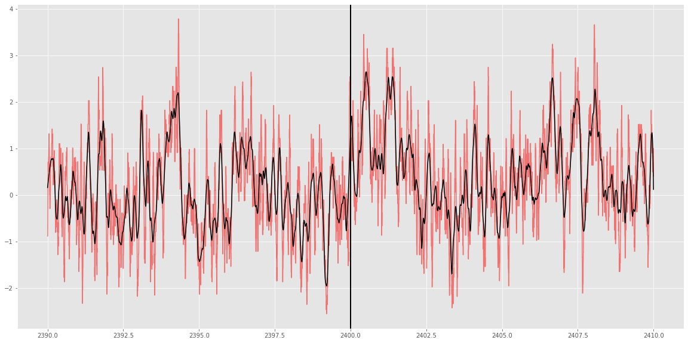
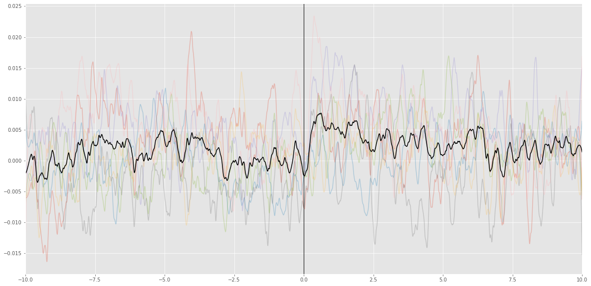

Analysis
========

.. code:: ipython3

    import pyfiber as pf

.. parsed-literal::

    Configuration file at: C:\Users\mceau/.pyfiber/pyfiber.yaml
    

.. code:: ipython3

    s = pf.Session(fiber='../DATA/FIBER/AD21R_rat_2_SA_j23/AD21RSA1RAT215072021_0.csv',
                   behavior='../DATA/FIBER/AD21R_rat_2_SA_j23/bsa15072021c20_01.dat')

.. parsed-literal::

    13:49:45 --- IMPORTING ../DATA/FIBER/AD21R_rat_2_SA_j23/bsa15072021c20_01.dat...
    13:49:45 --- Detecting hled_on...                      ['conditional', [1, 1], ['_P', 1]])
    13:49:45 --- Detecting hled_off...                     ['conditional', [1, 1], ['_P', 0]])
    13:49:45 --- Detecting led1_on...                      ['conditional', [1, 2], ['_P', 1]])
    13:49:45 --- Detecting led1_off...                     ['conditional', [1, 2], ['_P', 0]])
    13:49:45 --- Detecting led2_on...                      ['conditional', [1, 3], ['_P', 1]])
    13:49:45 --- Detecting led2_off...                     ['conditional', [1, 3], ['_P', 0]])
    13:49:45 --- Detecting np1...                          ['conditional', [3, 1], ['_V', 1]])
    13:49:45 --- Detecting np2...                          ['conditional', [3, 2], ['_V', 1]])
    13:49:45 --- Detecting inj1...                         ['conditional', [6, 1], ['_L', 1]])
    13:49:45 --- Detecting ttl1_on...                      ['conditional', [15, 1], ['_L', 1]])
    13:49:45 --- Detecting ttl1_off...                     ['conditional', [15, 1], ['_L', 0]])
    13:49:45 --- Detecting x_coordinates...                ['simple', [9, 1], '_X'])
    13:49:45 --- Detecting y_coordinates...                ['simple', [9, 1], '_Y'])
    13:49:45 --- Detecting xy_timestamps...                ['simple', [9, 1], 'TIME'])
    13:49:45 --- Detecting HLED...                         ['ON_OFF', 'both', ['hled_on', 'hled_off']])
    13:49:45 --- Detecting LED1...                         ['ON_OFF', 'both', ['led1_on', 'led1_off']])
    13:49:45 --- Detecting LED2...                         ['ON_OFF', 'both', ['led2_on', 'led2_off']])
    13:49:45 --- Detecting TTL1...                         ['ON_OFF', 'both', ['ttl1_on', 'ttl1_off']])
    13:49:45 --- Detecting rec_start...                    ['indexed', 'ttl1_on', 1])
    13:49:45 --- Detecting DARK...                         ['INTERSECTION', ['HLED_OFF', 'LED1_OFF', 'LED2_OFF']])
    13:49:45 --- Detecting DNI...                          ['NEAR_EVENT', 'DARK', 'inj1', 5])
    13:49:45 --- Detecting TO_DARK...                      ['DURATION', 'DNI', '<', 45])
    13:49:45 --- Detecting TIMEOUT...                      ['UNION', ['LED1_ON', 'TO_DARK']])
    13:49:45 --- Detecting NOTO_DARK...                    ['INTERSECTION', ['DARK', '~TIMEOUT']])
    13:49:45 --- Detecting noto_dark_end...                ['boundary', 'end', 'NOTO_DARK'])
    13:49:45 --- Detecting switch_dark_d1...               ['iselement', 'noto_dark_end', 'LED2_ON'])
    13:49:45 --- Detecting hled_on_start...                ['boundary', 'start', 'HLED_ON'])
    13:49:45 --- Detecting hled_on_end...                  ['boundary', 'end', 'HLED_ON'])
    13:49:45 --- Detecting switch_d_nd...                  ['iselement', 'hled_on_start', 'LED2_ON'])
    13:49:45 --- Detecting switch_to_nd...                 ['iselement', 'hled_on_start', 'TIMEOUT'])
    13:49:45 --- Detecting switch_dto_nd...                ['combination', ['switch_d_nd', 'switch_to_nd']])
    13:49:45 --- Detecting switch_nd_d...                  ['iselement', 'hled_on_end', 'LED2_ON'])
    13:49:45 --- Detecting switch_between...               ['timerestricted', 'switch_dto_nd', [100, 3400]])
    13:49:45 --- Detecting switch_1...                     ['indexed', 'switch_between', 1])
    13:49:45 --- Detecting switch_between_D...             ['timerestricted', 'switch_d_nd', [100, 3400]])
    13:49:45 --- Detecting switch_1_D...                   ['indexed', 'switch_between_D', 1])
    13:49:45 --- Detecting HLEDOFF_NODARK...               ['INTERSECTION', ['HLED_OFF', '~NOTO_DARK']])
    13:49:45 --- Detecting DRP...                          ['NEAR_EVENT', 'HLEDOFF_NODARK', 'led2_on', 1])
    13:49:45 --- Detecting DRP_LONG...                     ['DURATION', 'DRP', '>', 600])
    13:49:45 --- Detecting DRP_INJ...                      ['CONTAINS', 'DRP', 'inj1'])
    13:49:45 --- Detecting DRUG...                         ['UNION', ['DRP_LONG', 'DRP_INJ']])
    13:49:45 --- Detecting D_n...                          ['GENERATIVE', 'DRUG'])
    13:49:45 --- Detecting DRUG_NOTO...                    ['INTERSECTION', ['DRUG', '~TIMEOUT']])
    13:49:45 --- Detecting np_HF_NOTO...                   ['iselement', 'np1', 'DRUG_NOTO'])
    13:49:45 --- Detecting np_effective...                 ['iselement', 'np_HF_NOTO', 'LED2_ON'])
    13:49:45 --- Detecting np1_n...                        ['generative2', ['D_n', 'np_effective'], 5])
    13:49:45 --- Detecting ND_n...                         ['GENERATIVE', 'HLED_ON'])
    13:49:45 --- Detecting ND_first...                     ['NEAR_EVENT', 'HLED_ON', 'switch_1', 1])
    13:49:45 --- Detecting switch_nd1...                   ['boundary', 'end', 'ND_first'])
    13:49:45 --- Detecting inj_first...                    ['indexed', 'inj1', 1])
    13:49:45 --- Detecting npt...                          ['combination', ['np1', 'np2']])
    13:49:45 --- Detecting np1_ND_first...                 ['iselement', 'np1', 'ND_first'])
    13:49:45 --- Detecting np2_ND_first...                 ['iselement', 'np2', 'ND_first'])
    13:49:45 --- Detecting npt_ND_first...                 ['iselement', 'npt', 'ND_first'])
    13:49:45 --- Detecting np1_NDfirst_1...                ['indexed', 'np1_ND_first', 1])
    13:49:45 --- Detecting np2_NDfirst_1...                ['indexed', 'np2_ND_first', 1])
    13:49:45 --- Detecting npt_NDfirst_1...                ['indexed', 'npt_ND_first', 1])
    13:49:45 --- Importing finished in 0.064 seconds
    
    13:49:45 --- Importing ../DATA/FIBER/AD21R_rat_2_SA_j23/AD21RSA1RAT215072021_0.csv...
    13:49:46 --- Found 4 separate recordings.
    13:49:46 --- Analyzing peaks...
    13:49:46 --- Normalizing recording 1 with method 'F'
    13:49:46 --- Normalizing recording 2 with method 'F'
    13:49:46 --- Normalizing recording 3 with method 'F'
    13:49:46 --- Normalizing recording 4 with method 'F'
    13:49:46 --- Importing of ../DATA/FIBER/AD21R_rat_2_SA_j23/AD21RSA1RAT215072021_0.csv finished in 1.1879823207855225 seconds
    

.. code:: ipython3

    s.behavior.switch_1

.. parsed-literal::

    array([2400.])

.. code:: ipython3

    a = s.analyze(2400, window=(10,10))

.. parsed-literal::

    13:50:18 --- Normalizing recording 2 with method 'F'
    13:50:18 --- Normalizing recording 2 with method 'raw'
    

.. code:: ipython3

    a.plot('zscores')

.. code:: ipython3

    ms = pf.MultiSession('../DATA/FIBER_SAMPLE/',verbosity=False)

.. parsed-literal::

    folder ../DATA/FIBER_SAMPLE/
    

.. code:: ipython3

    ma = ms.analyze('switch_1', window=(10,10))

.. code:: ipython3

    ma.info

.. parsed-literal::

    <obj>.EPOCH
    <obj>.RAW_CONTROL
    <obj>.RAW_SIGNAL
    <obj>.ROB_ZSCORES
    <obj>.SIGNAL
    <obj>.TIME
    <obj>.WINDOW
    <obj>.ZSCORES
    <obj>.behaviorfile
    <obj>.data
    <obj>.dict
    <obj>.epoch
    <obj>.event_name
    <obj>.event_time
    <obj>.exclude_list
    <obj>.fiberfile
    <obj>.interpolated_epoch
    <obj>.interpolated_raw_control
    <obj>.interpolated_raw_signal
    <obj>.interpolated_rob_zscores
    <obj>.interpolated_signal
    <obj>.interpolated_time
    <obj>.interpolated_zscores
    <obj>.key
    <obj>.nb_of_points
    <obj>.normalisation
    <obj>.postAUC
    <obj>.postAVG_RZ
    <obj>.postAVG_Z
    <obj>.postAVG_dF
    <obj>.postRZ_AUC
    <obj>.postZ_AUC
    <obj>.post_Rzscores
    <obj>.post_peak_avg_Z
    <obj>.post_peak_avg_dFF
    <obj>.post_peak_frequency
    <obj>.post_peak_max_Z
    <obj>.post_peak_max_dFF
    <obj>.post_raw_AUC
    <obj>.post_raw_ctrl
    <obj>.post_raw_sig
    <obj>.post_time
    <obj>.post_zscores
    <obj>.postevent
    <obj>.preAUC
    <obj>.preAVG_RZ
    <obj>.preAVG_Z
    <obj>.preAVG_dF
    <obj>.preRZ_AUC
    <obj>.preZ_AUC
    <obj>.pre_Rzscores
    <obj>.pre_peak_avg_Z
    <obj>.pre_peak_avg_dFF
    <obj>.pre_peak_frequency
    <obj>.pre_peak_max_Z
    <obj>.pre_peak_max_dFF
    <obj>.pre_raw_AUC
    <obj>.pre_raw_sig
    <obj>.pre_time
    <obj>.pre_zscores
    <obj>.preevent
    <obj>.raw_control
    <obj>.raw_signal
    <obj>.rawdata
    <obj>.rec_number
    <obj>.recordingdata
    <obj>.rob_zscores
    <obj>.sampling_rate
    <obj>.signal
    <obj>.time
    <obj>.window
    <obj>.zscores
    

.. code:: ipython3

    ma.data

.. raw:: html

    

    
    <table border="1" class="dataframe">
      <thead>
        <tr style="text-align: right;">
          <th></th>
          <th>behaviorfile</th>
          <th>event_time</th>
          <th>fiberfile</th>
          <th>normalisation</th>
          <th>postAUC</th>
          <th>postAVG_RZ</th>
          <th>postAVG_Z</th>
          <th>postAVG_dF</th>
          <th>postRZ_AUC</th>
          <th>postZ_AUC</th>
          <th>...</th>
          <th>preZ_AUC</th>
          <th>pre_peak_avg_Z</th>
          <th>pre_peak_avg_dFF</th>
          <th>pre_peak_frequency</th>
          <th>pre_peak_max_Z</th>
          <th>pre_peak_max_dFF</th>
          <th>pre_raw_AUC</th>
          <th>rec_number</th>
          <th>sampling_rate</th>
          <th>window</th>
        </tr>
      </thead>
      <tbody>
        <tr>
          <th>AD21R_rat_2_SA_j42</th>
          <td>../DATA/FIBER_SAMPLE/AD21R_rat_2_SA_j42\bsa110...</td>
          <td>2400.000</td>
          <td>../DATA/FIBER_SAMPLE/AD21R_rat_2_SA_j42\rat2sa...</td>
          <td>F</td>
          <td>0.025722</td>
          <td>-0.065773</td>
          <td>-0.034664</td>
          <td>0.002570</td>
          <td>-0.654216</td>
          <td>-0.344290</td>
          <td>...</td>
          <td>0.001370</td>
          <td>2.058082</td>
          <td>0.021692</td>
          <td>2.2</td>
          <td>3.038234</td>
          <td>0.032021</td>
          <td>1.554369</td>
          <td>2</td>
          <td>1212.488800</td>
          <td>(10, 10)</td>
        </tr>
        <tr>
          <th>AK20R_rat_3_SA_j17</th>
          <td>../DATA/FIBER_SAMPLE/AK20R_rat_3_SA_j17\bsa191...</td>
          <td>2400.002</td>
          <td>../DATA/FIBER_SAMPLE/AK20R_rat_3_SA_j17\rat 3 ...</td>
          <td>F</td>
          <td>0.012637</td>
          <td>0.577501</td>
          <td>0.292794</td>
          <td>0.001264</td>
          <td>5.773983</td>
          <td>2.927327</td>
          <td>...</td>
          <td>-0.005234</td>
          <td>1.768366</td>
          <td>0.013148</td>
          <td>2.4</td>
          <td>2.973392</td>
          <td>0.022109</td>
          <td>2.764812</td>
          <td>3</td>
          <td>1212.474856</td>
          <td>(10, 10)</td>
        </tr>
        <tr>
          <th>AL21R_rat_3_NCIBSL_j37</th>
          <td>../DATA/FIBER_SAMPLE/AL21R_rat_3_NCIBSL_j37\bs...</td>
          <td>2400.000</td>
          <td>../DATA/FIBER_SAMPLE/AL21R_rat_3_NCIBSL_j37\AL...</td>
          <td>F</td>
          <td>0.066639</td>
          <td>0.792337</td>
          <td>0.501397</td>
          <td>0.006664</td>
          <td>7.923244</td>
          <td>5.013869</td>
          <td>...</td>
          <td>-0.000060</td>
          <td>2.325809</td>
          <td>0.018943</td>
          <td>1.4</td>
          <td>2.861402</td>
          <td>0.023305</td>
          <td>1.571765</td>
          <td>1</td>
          <td>1212.489754</td>
          <td>(10, 10)</td>
        </tr>
        <tr>
          <th>AS21R_rat_10_SA1_j22</th>
          <td>../DATA/FIBER_SAMPLE/AS21R_rat_10_SA1_j22\bsa0...</td>
          <td>2400.001</td>
          <td>../DATA/FIBER_SAMPLE/AS21R_rat_10_SA1_j22\AS21...</td>
          <td>F</td>
          <td>-0.008051</td>
          <td>0.451519</td>
          <td>0.298840</td>
          <td>-0.000808</td>
          <td>4.520103</td>
          <td>2.991751</td>
          <td>...</td>
          <td>0.000279</td>
          <td>1.560379</td>
          <td>0.018063</td>
          <td>1.9</td>
          <td>2.544587</td>
          <td>0.029455</td>
          <td>1.641309</td>
          <td>2</td>
          <td>1212.474249</td>
          <td>(10, 10)</td>
        </tr>
        <tr>
          <th>AS21R_rat_11_SA5_j33</th>
          <td>../DATA/FIBER_SAMPLE/AS21R_rat_11_SA5_j33\bsa1...</td>
          <td>2400.007</td>
          <td>../DATA/FIBER_SAMPLE/AS21R_rat_11_SA5_j33\AS21...</td>
          <td>F</td>
          <td>0.010470</td>
          <td>0.039655</td>
          <td>0.039895</td>
          <td>0.001047</td>
          <td>0.397453</td>
          <td>0.399561</td>
          <td>...</td>
          <td>0.001592</td>
          <td>2.241051</td>
          <td>0.016517</td>
          <td>2.1</td>
          <td>3.017688</td>
          <td>0.022241</td>
          <td>1.731620</td>
          <td>2</td>
          <td>1212.490012</td>
          <td>(10, 10)</td>
        </tr>
        <tr>
          <th>AS21R_rat_5_SA6_j37</th>
          <td>../DATA/FIBER_SAMPLE/AS21R_rat_5_SA6_j37\bsa23...</td>
          <td>2400.000</td>
          <td>../DATA/FIBER_SAMPLE/AS21R_rat_5_SA6_j37\AS21R...</td>
          <td>F</td>
          <td>0.041647</td>
          <td>1.105359</td>
          <td>0.777822</td>
          <td>0.004164</td>
          <td>11.054853</td>
          <td>7.779106</td>
          <td>...</td>
          <td>0.000589</td>
          <td>1.549028</td>
          <td>0.015241</td>
          <td>1.7</td>
          <td>2.124176</td>
          <td>0.020900</td>
          <td>1.538536</td>
          <td>2</td>
          <td>1212.490300</td>
          <td>(10, 10)</td>
        </tr>
        <tr>
          <th>AS21R_rat_8_SA3_j27</th>
          <td>../DATA/FIBER_SAMPLE/AS21R_rat_8_SA3_j27\bsa09...</td>
          <td>2400.005</td>
          <td>../DATA/FIBER_SAMPLE/AS21R_rat_8_SA3_j27\AS21R...</td>
          <td>F</td>
          <td>0.047898</td>
          <td>-0.177228</td>
          <td>-0.096186</td>
          <td>0.004790</td>
          <td>-1.772036</td>
          <td>-0.961661</td>
          <td>...</td>
          <td>0.001397</td>
          <td>1.987483</td>
          <td>0.020698</td>
          <td>2.5</td>
          <td>2.634553</td>
          <td>0.027436</td>
          <td>1.438889</td>
          <td>2</td>
          <td>1212.489088</td>
          <td>(10, 10)</td>
        </tr>
      </tbody>
    </table>
    
7 rows × 31 columns

    

.. code:: ipython3

    ma.plot('signal')

