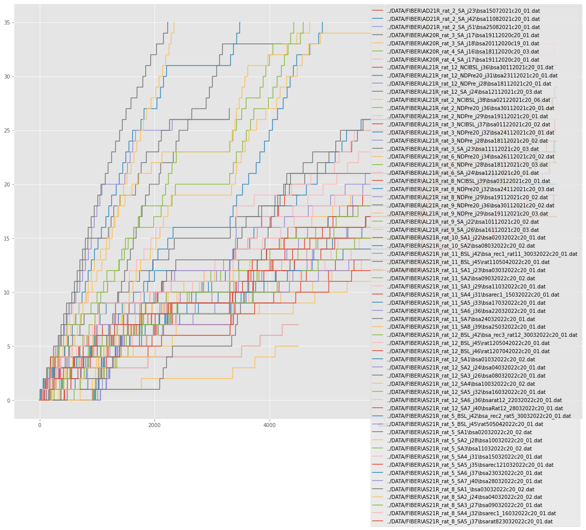
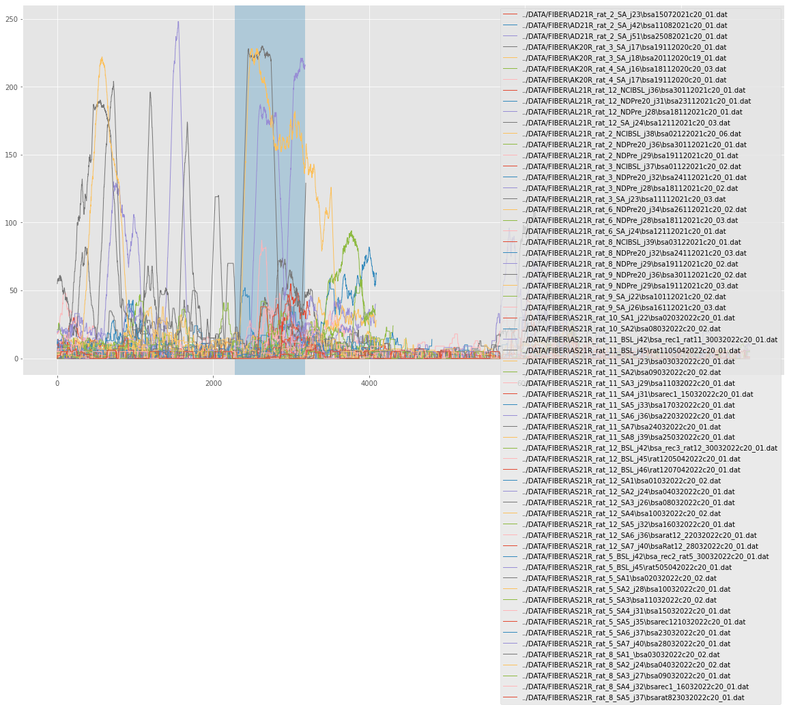
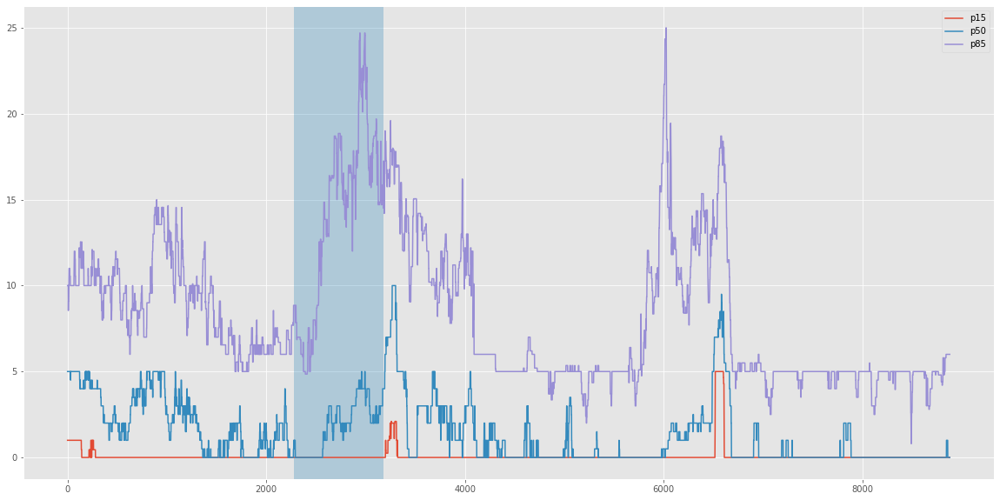

Behavior
========

.. code:: ipython3

    import pyfiber as pf

.. parsed-literal::

    Configuration file at: C:\Users\mceau/.pyfiber/pyfiber.yaml
    

.. code:: ipython3

    b = pf.Behavior('../DATA/FIBER/AS21R_rat_11_SA5_j33/bsa17032022c20_01.dat')

.. parsed-literal::

    16:53:36 --- IMPORTING ../DATA/FIBER/AS21R_rat_11_SA5_j33/bsa17032022c20_01.dat...
    16:53:36 --- Detecting hled_on...                      ['conditional', [1, 1], ['_P', 1]])
    16:53:36 --- Detecting hled_off...                     ['conditional', [1, 1], ['_P', 0]])
    16:53:36 --- Detecting led1_on...                      ['conditional', [1, 2], ['_P', 1]])
    16:53:36 --- Detecting led1_off...                     ['conditional', [1, 2], ['_P', 0]])
    16:53:36 --- Detecting led2_on...                      ['conditional', [1, 3], ['_P', 1]])
    16:53:36 --- Detecting led2_off...                     ['conditional', [1, 3], ['_P', 0]])
    16:53:36 --- Detecting np1...                          ['conditional', [3, 1], ['_V', 1]])
    16:53:36 --- Detecting np2...                          ['conditional', [3, 2], ['_V', 1]])
    16:53:36 --- Detecting inj1...                         ['conditional', [6, 1], ['_L', 1]])
    16:53:36 --- Detecting ttl1_on...                      ['conditional', [15, 1], ['_L', 1]])
    16:53:36 --- Detecting ttl1_off...                     ['conditional', [15, 1], ['_L', 0]])
    16:53:36 --- Detecting x_coordinates...                ['simple', [9, 1], '_X'])
    16:53:36 --- Detecting y_coordinates...                ['simple', [9, 1], '_Y'])
    16:53:36 --- Detecting xy_timestamps...                ['simple', [9, 1], 'TIME'])
    16:53:36 --- Detecting HLED...                         ['ON_OFF', 'both', ['hled_on', 'hled_off']])
    16:53:36 --- Detecting LED1...                         ['ON_OFF', 'both', ['led1_on', 'led1_off']])
    16:53:36 --- Detecting LED2...                         ['ON_OFF', 'both', ['led2_on', 'led2_off']])
    16:53:36 --- Detecting TTL1...                         ['ON_OFF', 'both', ['ttl1_on', 'ttl1_off']])
    16:53:36 --- Detecting rec_start...                    ['indexed', 'ttl1_on', 1])
    16:53:36 --- Detecting DARK...                         ['INTERSECTION', ['HLED_OFF', 'LED1_OFF', 'LED2_OFF']])
    16:53:36 --- Detecting DNI...                          ['NEAR_EVENT', 'DARK', 'inj1', 5])
    16:53:36 --- Detecting TO_DARK...                      ['DURATION', 'DNI', '<', 45])
    16:53:36 --- Detecting TIMEOUT...                      ['UNION', ['LED1_ON', 'TO_DARK']])
    16:53:36 --- Detecting NOTO_DARK...                    ['INTERSECTION', ['DARK', '~TIMEOUT']])
    16:53:36 --- Detecting noto_dark_end...                ['boundary', 'end', 'NOTO_DARK'])
    16:53:36 --- Detecting switch_dark_d1...               ['iselement', 'noto_dark_end', 'LED2_ON'])
    16:53:36 --- Detecting hled_on_start...                ['boundary', 'start', 'HLED_ON'])
    16:53:36 --- Detecting hled_on_end...                  ['boundary', 'end', 'HLED_ON'])
    16:53:36 --- Detecting switch_d_nd...                  ['iselement', 'hled_on_start', 'LED2_ON'])
    16:53:36 --- Detecting switch_to_nd...                 ['iselement', 'hled_on_start', 'TIMEOUT'])
    16:53:36 --- Detecting switch_dto_nd...                ['combination', ['switch_d_nd', 'switch_to_nd']])
    16:53:36 --- Detecting switch_nd_d...                  ['iselement', 'hled_on_end', 'LED2_ON'])
    16:53:36 --- Detecting switch_between...               ['timerestricted', 'switch_dto_nd', [100, 3400]])
    16:53:36 --- Detecting switch_1...                     ['indexed', 'switch_between', 1])
    16:53:36 --- Detecting HLEDOFF_NODARK...               ['INTERSECTION', ['HLED_OFF', '~NOTO_DARK']])
    16:53:36 --- Detecting DRP...                          ['NEAR_EVENT', 'HLEDOFF_NODARK', 'led2_on', 1])
    16:53:36 --- Detecting DRP_LONG...                     ['DURATION', 'DRP', '>', 600])
    16:53:36 --- Detecting DRP_INJ...                      ['CONTAINS', 'DRP', 'inj1'])
    16:53:36 --- Detecting DRUG...                         ['UNION', ['DRP_LONG', 'DRP_INJ']])
    16:53:36 --- Detecting D_n...                          ['GENERATIVE', 'DRUG'])
    16:53:36 --- Detecting DRUG_NOTO...                    ['INTERSECTION', ['DRUG', '~TIMEOUT']])
    16:53:36 --- Detecting np_HF_NOTO...                   ['iselement', 'np1', 'DRUG_NOTO'])
    16:53:36 --- Detecting np_effective...                 ['iselement', 'np_HF_NOTO', 'LED2_ON'])
    16:53:36 --- Detecting np1_n...                        ['generative2', ['D_n', 'np_effective'], 5])
    16:53:36 --- Detecting ND_n...                         ['GENERATIVE', 'HLED_ON'])
    16:53:36 --- Detecting ND_first...                     ['NEAR_EVENT', 'HLED_ON', 'switch_1', 1])
    16:53:36 --- Detecting switch_nd1...                   ['boundary', 'end', 'ND_first'])
    16:53:36 --- Detecting inj_first...                    ['indexed', 'inj1', 1])
    16:53:36 --- Detecting npt...                          ['combination', ['np1', 'np2']])
    16:53:36 --- Detecting np1_ND_first...                 ['iselement', 'np1', 'ND_first'])
    16:53:36 --- Detecting np2_ND_first...                 ['iselement', 'np2', 'ND_first'])
    16:53:36 --- Detecting npt_ND_first...                 ['iselement', 'npt', 'ND_first'])
    16:53:36 --- Detecting np1_NDfirst_1...                ['indexed', 'np1_ND_first', 1])
    16:53:36 --- Detecting np2_NDfirst_1...                ['indexed', 'np2_ND_first', 1])
    16:53:36 --- Detecting npt_NDfirst_1...                ['indexed', 'npt_ND_first', 1])
    16:53:36 --- Importing finished in 0.091 seconds
    
    

.. code:: ipython3

    b.summary()

.. image:: output_2_0.png

.. code:: ipython3

    mb = pf.MultiBehavior('../DATA/FIBER', verbosity=False)

.. code:: ipython3

    mb.cumul('inj1')

.. code:: ipython3

    mb.show_rate('np1')

