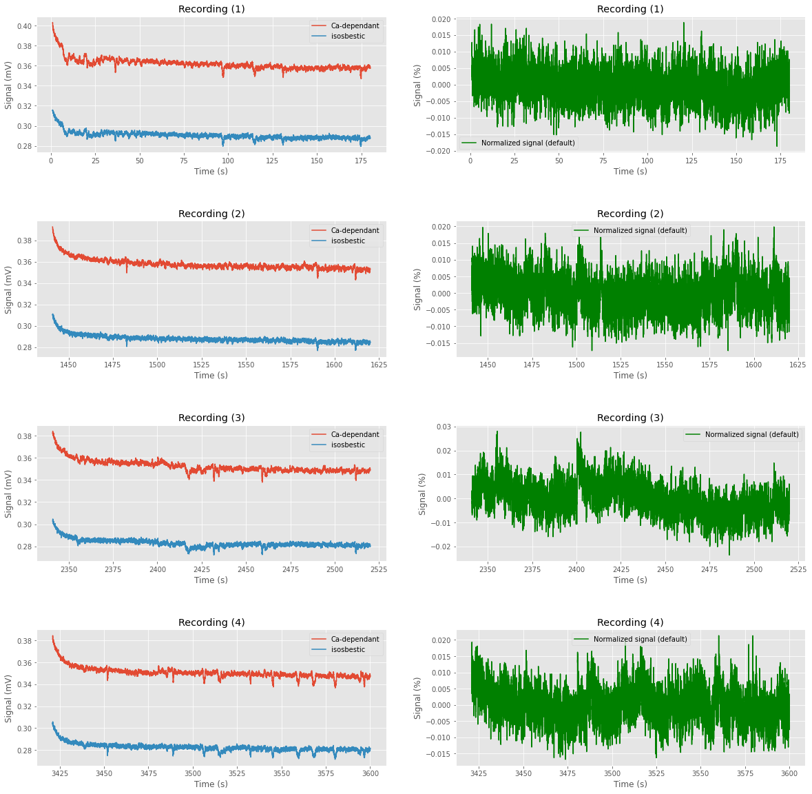
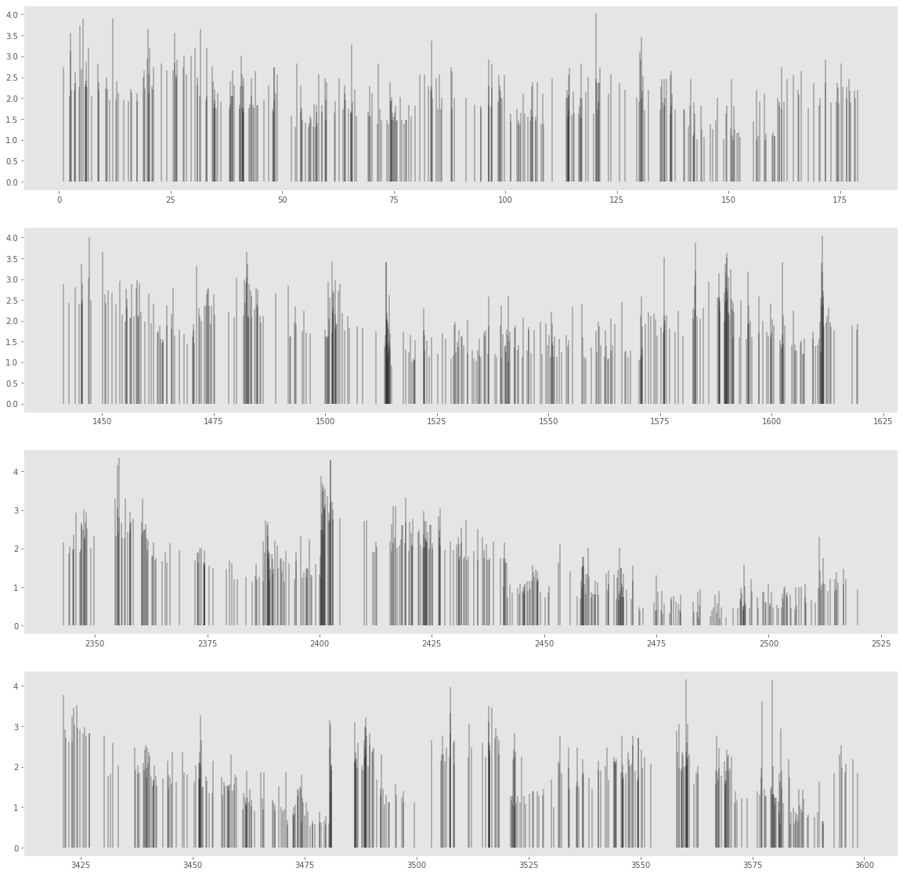

Fiber
=====

.. code:: ipython3

    import pyfiber as pf

.. parsed-literal::

    Configuration file at: C:\Users\mceau/.pyfiber/pyfiber.yaml
    

.. code:: ipython3

    f = pf.Fiber('../DATA/FIBER/AK20R_rat_4_SA_j16/rat 4 AK20R SESSION 18 11 2020_0.csv')

.. parsed-literal::

    17:18:05 --- Importing ../DATA/FIBER/AK20R_rat_4_SA_j16/rat 4 AK20R SESSION 18 11 2020_0.csv...
    17:18:06 --- Found 4 separate recordings.
    17:18:06 --- Analyzing peaks...
    17:18:06 --- Normalizing recording 1 with method 'F'
    17:18:06 --- Normalizing recording 2 with method 'F'
    17:18:06 --- Normalizing recording 3 with method 'F'
    17:18:06 --- Normalizing recording 4 with method 'F'
    17:18:06 --- Importing of ../DATA/FIBER/AK20R_rat_4_SA_j16/rat 4 AK20R SESSION 18 11 2020_0.csv finished in 1.180614709854126 seconds
    

.. code:: ipython3

    f.plot()

.. parsed-literal::

    17:18:06 --- Normalizing recording 1 with method 'F'
    17:18:06 --- Normalizing recording 2 with method 'F'
    17:18:06 --- Normalizing recording 3 with method 'F'
    17:18:06 --- Normalizing recording 4 with method 'F'
    17:18:06 --- Normalizing recording 1 with method 'raw'
    17:18:06 --- Normalizing recording 2 with method 'raw'
    17:18:06 --- Normalizing recording 3 with method 'raw'
    17:18:06 --- Normalizing recording 4 with method 'raw'
    

.. code:: ipython3

    f.plot_transients()

.. code:: ipython3

    f.df

.. raw:: html

    

    
    <table border="1" class="dataframe">
      <thead>
        <tr style="text-align: right;">
          <th></th>
          <th>Time(s)</th>
          <th>AIn-2 - Demodulated(Lock-In)</th>
          <th>AIn-1 - Demodulated(Lock-In)</th>
        </tr>
      </thead>
      <tbody>
        <tr>
          <th>0</th>
          <td>0.000371</td>
          <td>0.295419</td>
          <td>0.376293</td>
        </tr>
        <tr>
          <th>1</th>
          <td>0.001197</td>
          <td>0.295724</td>
          <td>0.375683</td>
        </tr>
        <tr>
          <th>2</th>
          <td>0.002022</td>
          <td>0.295419</td>
          <td>0.374876</td>
        </tr>
        <tr>
          <th>3</th>
          <td>0.002847</td>
          <td>0.295938</td>
          <td>0.375072</td>
        </tr>
        <tr>
          <th>4</th>
          <td>0.003671</td>
          <td>0.295419</td>
          <td>0.375072</td>
        </tr>
        <tr>
          <th>...</th>
          <td>...</td>
          <td>...</td>
          <td>...</td>
        </tr>
        <tr>
          <th>873323</th>
          <td>3600.025910</td>
          <td>0.281381</td>
          <td>0.347301</td>
        </tr>
        <tr>
          <th>873324</th>
          <td>3600.026730</td>
          <td>0.281381</td>
          <td>0.347301</td>
        </tr>
        <tr>
          <th>873325</th>
          <td>3600.027550</td>
          <td>0.281381</td>
          <td>0.347301</td>
        </tr>
        <tr>
          <th>873326</th>
          <td>3600.028370</td>
          <td>0.281381</td>
          <td>0.347301</td>
        </tr>
        <tr>
          <th>873327</th>
          <td>3600.029190</td>
          <td>0.281686</td>
          <td>0.347301</td>
        </tr>
      </tbody>
    </table>
    
873328 rows × 3 columns

    

.. code:: ipython3

    f.data

.. raw:: html

    

    
    <table border="1" class="dataframe">
      <thead>
        <tr style="text-align: right;">
          <th></th>
          <th>time</th>
          <th>signal</th>
          <th>control</th>
        </tr>
      </thead>
      <tbody>
        <tr>
          <th>0</th>
          <td>0.000371</td>
          <td>0.376293</td>
          <td>0.295419</td>
        </tr>
        <tr>
          <th>1</th>
          <td>0.001197</td>
          <td>0.375683</td>
          <td>0.295724</td>
        </tr>
        <tr>
          <th>2</th>
          <td>0.002022</td>
          <td>0.374876</td>
          <td>0.295419</td>
        </tr>
        <tr>
          <th>3</th>
          <td>0.002847</td>
          <td>0.375072</td>
          <td>0.295938</td>
        </tr>
        <tr>
          <th>4</th>
          <td>0.003671</td>
          <td>0.375072</td>
          <td>0.295419</td>
        </tr>
        <tr>
          <th>...</th>
          <td>...</td>
          <td>...</td>
          <td>...</td>
        </tr>
        <tr>
          <th>873323</th>
          <td>3600.025910</td>
          <td>0.347301</td>
          <td>0.281381</td>
        </tr>
        <tr>
          <th>873324</th>
          <td>3600.026730</td>
          <td>0.347301</td>
          <td>0.281381</td>
        </tr>
        <tr>
          <th>873325</th>
          <td>3600.027550</td>
          <td>0.347301</td>
          <td>0.281381</td>
        </tr>
        <tr>
          <th>873326</th>
          <td>3600.028370</td>
          <td>0.347301</td>
          <td>0.281381</td>
        </tr>
        <tr>
          <th>873327</th>
          <td>3600.029190</td>
          <td>0.347301</td>
          <td>0.281686</td>
        </tr>
      </tbody>
    </table>
    
873328 rows × 3 columns

    

.. code:: ipython3

    f.peaks[1]

.. raw:: html

    

    
    <table border="1" class="dataframe">
      <thead>
        <tr style="text-align: right;">
          <th></th>
          <th>time</th>
          <th>dF/F</th>
          <th>zscore</th>
        </tr>
      </thead>
      <tbody>
        <tr>
          <th>0</th>
          <td>1.035437</td>
          <td>0.012789</td>
          <td>2.732143</td>
        </tr>
        <tr>
          <th>1</th>
          <td>2.518300</td>
          <td>0.009522</td>
          <td>2.034297</td>
        </tr>
        <tr>
          <th>2</th>
          <td>2.579331</td>
          <td>0.014647</td>
          <td>3.129175</td>
        </tr>
        <tr>
          <th>3</th>
          <td>2.646978</td>
          <td>0.016634</td>
          <td>3.553634</td>
        </tr>
        <tr>
          <th>4</th>
          <td>2.729428</td>
          <td>0.010284</td>
          <td>2.197055</td>
        </tr>
        <tr>
          <th>...</th>
          <td>...</td>
          <td>...</td>
          <td>...</td>
        </tr>
        <tr>
          <th>362</th>
          <td>177.075828</td>
          <td>0.010202</td>
          <td>2.179421</td>
        </tr>
        <tr>
          <th>363</th>
          <td>177.366182</td>
          <td>0.008882</td>
          <td>1.897383</td>
        </tr>
        <tr>
          <th>364</th>
          <td>178.185143</td>
          <td>0.010202</td>
          <td>2.179421</td>
        </tr>
        <tr>
          <th>365</th>
          <td>178.425961</td>
          <td>0.009358</td>
          <td>1.999205</td>
        </tr>
        <tr>
          <th>366</th>
          <td>178.993354</td>
          <td>0.010248</td>
          <td>2.189298</td>
        </tr>
      </tbody>
    </table>
    
367 rows × 3 columns

    

